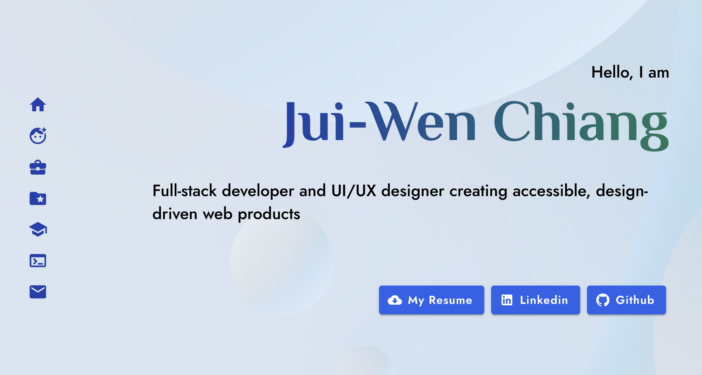

# Welcome to My Portfolio Website
[🐱 Explore the Live Site Here](https://jui-wen-chiang.github.io/portfolio-juiwenchiang)

Hi there! 

This repository contains the source code for my personal website—a fully **responsive and cross-device compatible** platform designed to showcase my technical skills, professional journey, and latest engineering projects.

## Key Features
* Fully Responsive: Optimized for everything from mobile screens to large desktop monitors.
*  Accessibility First:  Built in strict alignment with Web Content Accessibility Guidelines (WCAG) to ensure an inclusive digital experience for all users.
* Design meets Code: Crafted with a strong focus on bridging technical execution with refined UI/UX aesthetics.

